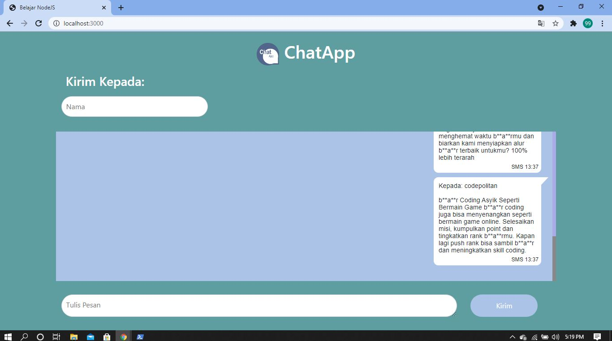
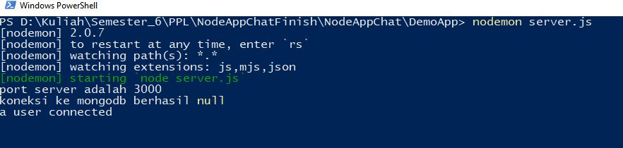

# BadwordSensor
## Deskripsi
Program untuk menyensor kata-kata tertentu, kata-kata buruk atau badword akan disensor dengan tanda "*" bintang. Badword dapat ditentukan sendiri oleh pembuat dan program akan menyensor kata tersebut secara otomatis.

## Tampilan
Program ini diterapkan pada sebuah tampilan chat atau perpesanan. Untuk tampilan yang digunakan terlihat seperti dibawah ini:

## Cara Menggunakan
1. Code ini dibuat dengan node.js jadi pastikan perangkat sudah memiliki atau meng-install node.js. 
2. Setelah install node.js lakukan instalasi nodemon untuk menjalankan server. 
3. Jika keduanya sudah di install selanjutnya install mongoDB untuk database yang digunakan. 
4. Jika sudah selesai dengan instalasi sekarang import file badword.json kedalam mongoDB, ini adalah file berisi daftar badword.
5. Setelah selesai, masuk ke direktori dimana anda menyimpan file program dan jalankan server.js dengan nodemon(lihat gambar dibawah).

## Apa saja yang dibutuhkan
- Node.js
- Npm
- Nodemon
- MongoDB
